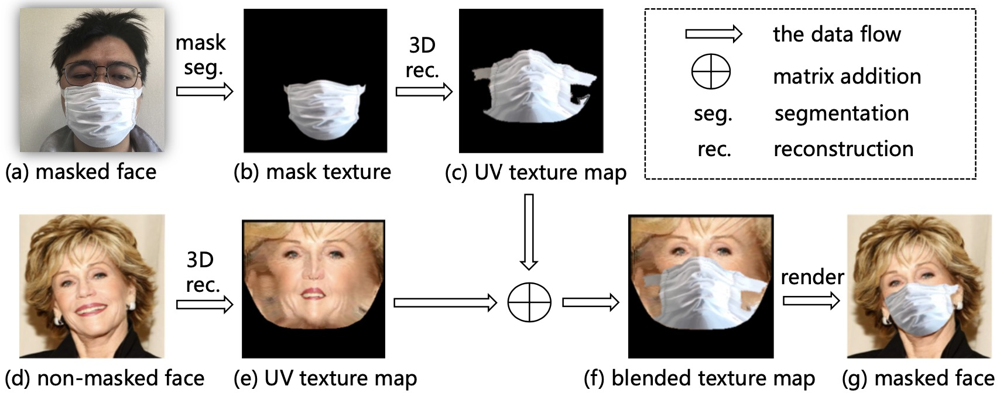
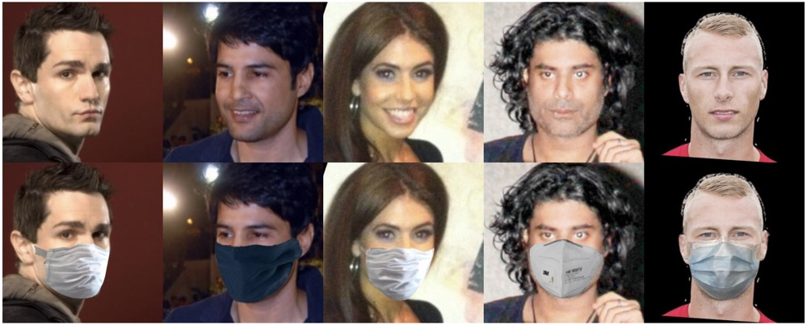

# MaskFaceTool
[English](README.md) **|** [简体中文](README_CN.md)
---
This project aims to add masks to the facial dataset, which is based on FMA-3D and constructs a effective, easy to operate, and efficient pipeline for facial detection, alignment, and mask wearing.
# Features
* Effect: Images generated based on FMA-3D are more realistic
* Efficient: This project provides a dual acceleration solution, using cython and multi process acceleration
* Easy: You can combine any acceleration scheme according to the server configuration
* Write the whole process by multi-processing.
* Write the function of render in [face_masker.py](face_masker.py) by c++.
* Resolve the bug of noisy generated images

# FMA-3D
A method for adding a mask on a non-masked face image. Given a real masked face image (a) and a non-masked face image (d), we synthesize a photo-realistic masked face image with the mask from (a) and the facial area from (d). 


# Some Results by FMA-3D


# Speed Up
To use Cython acceleration, you need to first compile files under the Linux system
* Step 1: Enter the utils/Python directory
* Step 2: Execute `python setup.py build_ext -i` Generate file
* Step 3: Rename the generated. so file to render.so

# Usage
* normal
``` 
python add_mask.py <input-dir-path> -o <output-dir-path> -r <sample-ratio> -s <1: Using Cython to speed up, 0: No speed up>

# Example
python add_mask.py ./webface42m -o ./output -r 0.1 -s 1
```
* use multi process acceleration 
``` 
python add_mask_multiproc.py <input-dir-path> -o <output-dir-path> -r <sample-ratio> -s <1: Using Cython to speed up, 0: No speed up> -c <nums-cpu-cores>

# Example
python add_mask_multiproc.py ./webface42m -o ./output -r 0.1 -s 1 -c 8
```

# Requirements
* python >= 3.7.1
* numpy
* pyyaml
* pytorch
* torchvision
* scikit-image
* opencv-python
* Cython(optional)


# Reference  
[yfeng95/PRNet](https://github.com/yfeng95/PRNet)

[JDAI-CV/FaceX-Zoo](https://github.com/JDAI-CV/FaceX-Zoo)

[zengwb-lx/Face_Mask_Add](https://github.com/zengwb-lx/Face_Mask_Add)