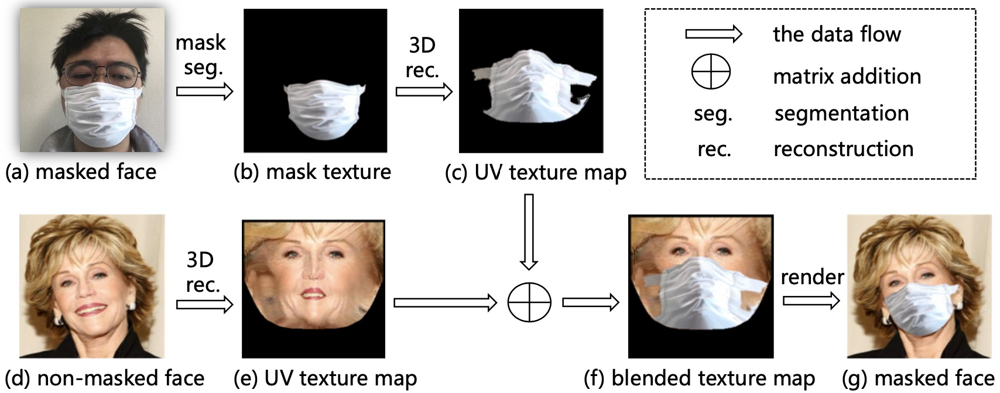
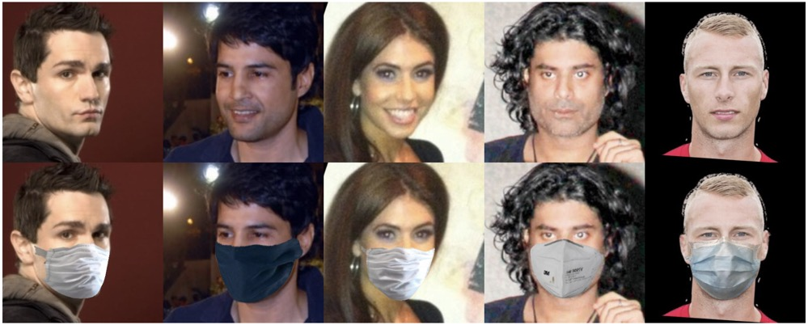

# MaskFaceTool
[English](README.md) **|** [简体中文](README_CN.md)
---
这个项目旨在为人脸数据集添加口罩，它基于FMA-3D，并构建了一个高质量、易于操作且高效率的人脸检测、对齐和口罩佩戴的流水线。

# 特性
* 高质量：基于FMA-3D的三维重建方法，能够生成更加真实的口罩人脸图片。
* 易于操作：用户可以根据服务器配置任意组合加速方案
* 高效率：本项目提供了双重加速方案，使用cython和多进程加速
* 实现了多进程
* 核心函数使用了c++加速
* 修复生成的图片有噪点的bug

# FMA-3D
一种在未佩戴口罩的人脸图像上添加口罩的方法。给定一个真实的口罩图像（a）和一个未带口罩的面部图像（d），我们合成了一个具有（a）中的口罩和（d）中的面部区域的，高真实感口罩图像。


# FMA-3D 效果



# 使用cython加速
使用cython加速，需要先在linux系统下编译文件
* step1:进入到utils/cython目录下
* step2:执行`python setup.py build_ext -i` 生成文件
* step3:将生成.so文件重命名为render.so

# 使用
* 正常模式
``` 
python add_mask.py <input-dir-path> -o <output-dir-path> -r <sample-ratio> -s <1: Using Cython to speed up, 0: No speed up>

# 例子
python add_mask.py ./webface42m -o ./output -r 0.1 -s 1
```
* 使用多进程加速
``` 
python add_mask_multiproc.py <input-dir-path> -o <output-dir-path> -r <sample-ratio> -s <1: Using Cython to speed up, 0: No speed up> -c <nums-cpu-cores>

# 例子
python add_mask_multiproc.py ./webface42m -o ./output -r 0.1 -s 1 -c 8
```

# 环境要求
* python >= 3.7.1
* numpy
* pyyaml
* pytorch
* torchvision
* scikit-image
* opencv-python
* Cython(可选)

# 参考
[yfeng95/PRNet](https://github.com/yfeng95/PRNet)

[JDAI-CV/FaceX-Zoo](https://github.com/JDAI-CV/FaceX-Zoo)

[zengwb-lx/Face_Mask_Add](https://github.com/zengwb-lx/Face_Mask_Add)